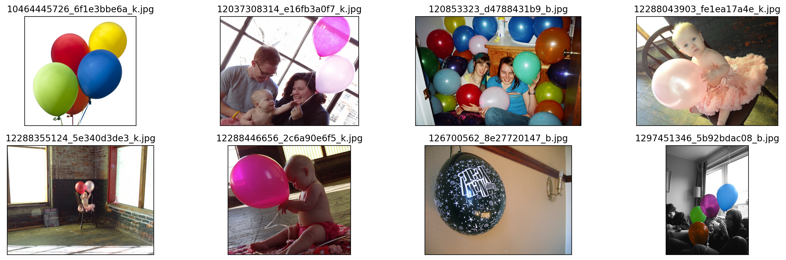

# 训练得到的模型精度
```python
Epoch(test) [13/13]  coco/bbox_mAP: 0.7320  coco/bbox_mAP_50: 0.8490  coco/bbox_mAP_75: 0.8230  coco/bbox_mAP_s: 0.0000  coco/bbox_mAP_m: 0.4510  coco/bbox_mAP_l: 0.8630  data_time: 0.4074  time: 0.5719
```

训练得到的结果见work_dir文件夹，配置文件为[hw_balloon.py]('hw_balloon.py')

配置文件和数据处理部分我不熟悉，所以参照这位同学的[work](https://github.com/CrabBoss-lab/openmmlab-Camp/tree/master/03-mmdetection-task)


# 检查数据集的结果


# 单张图片推理结果

